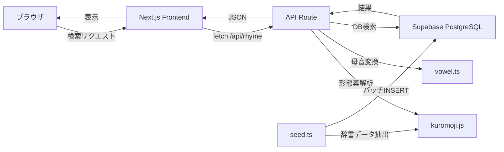

# Rhymee - 日本語韻検索 API & Web アプリ

日本語の単語を入力すると、同じ母音パターンを持つ単語を見つけるWebアプリ & パブリックAPI。
ラップ、歌詞、詩作、言葉遊びなど、韻を踏みたいすべての人のためのツールです。

## Built with Claude Code

このプロジェクトは、企画・設計からコーディング・デバッグ・デプロイまで、ほぼすべての工程を [Claude Code](https://docs.anthropic.com/en/docs/claude-code) (Anthropic の AI コーディングエージェント) と対話しながら構築しました。

「これからの開発は、人が手を動かすだけでなく、AIを動かして実装する時代になる」——その考えのもと、プロンプトで要件を伝え、AI が生成したコードをレビュー・調整するワークフローを実践しています。

> **Human が考え、AI が書き、Human がレビューする。**
> この開発スタイルの実験プロジェクトでもあります。

## デモ

> 🔗 **[https://rhymee.vercel.app/](https://rhymee.vercel.app/)**

## 技術スタック

| カテゴリ   | 技術                     |
| ---------- | ------------------------ |
| Frontend   | Next.js 14+ (App Router) |
| Styling    | Tailwind CSS             |
| Backend    | Next.js API Routes       |
| Database   | Supabase (PostgreSQL)    |
| 形態素解析 | kuromoji.js (IPAdic)     |
| Language   | TypeScript (strict mode) |
| Deploy     | Vercel + Supabase        |

## アーキテクチャ



## セットアップ

### 前提条件

- Node.js 18+
- npm
- Supabase プロジェクト

### 1. リポジトリのクローン

```bash
git clone <repository-url>
cd rhyme-finder
npm install
```

### 2. 環境変数の設定

```bash
cp .env.local.example .env.local
```

`.env.local` を編集して Supabase の接続情報を設定:

```
NEXT_PUBLIC_SUPABASE_URL=https://xxxxx.supabase.co
SUPABASE_SERVICE_ROLE_KEY=eyJhbGci...
```

### 3. データベースのセットアップ

Supabase のダッシュボードで SQL Editor を開き、マイグレーションを実行:

```sql
-- supabase/migrations/001_create_words.sql の内容を実行
```

### 4. 辞書データの投入

```bash
npm run seed
```

kuromoji.js の内蔵辞書から単語データを抽出し、Supabase に投入します。

### 5. 開発サーバーの起動

```bash
npm run dev
```

http://localhost:3000 でアプリが起動します。

## API 仕様

詳細は [docs/api.md](docs/api.md) を参照してください。

### クイックスタート

```bash
# 「東京」と韻を踏む単語を検索
curl "https://rhymee.vercel.app/api/rhyme?word=東京"

# 完全一致モードで検索
curl "https://rhymee.vercel.app/api/rhyme?word=東京&mode=exact"

# ランダム順で取得
curl "https://rhymee.vercel.app/api/rhyme?word=東京&shuffle=true"
```

## 主な機能

- **3つの検索モード**: 完全一致 / 末尾一致 / 部分一致
- **韻スコアリング**: 母音一致を前提に、子音の一致度で 0〜100% のスコアを算出（100% は同音異義語のみ）
- **シャッフル機能**: ランダム順での結果表示
- **ページネーション**: 大量の結果を50件ずつ表示

## 今後の拡張予定

- [ ] レートリミットの実装
- [ ] API キー認証
- [ ] ユーザー辞書の登録機能
- [ ] お気に入り保存機能
- [ ] 韻を踏んだフレーズの自動生成（AI連携）
- [ ] NEologd 辞書への対応（新語・固有名詞の拡充）
